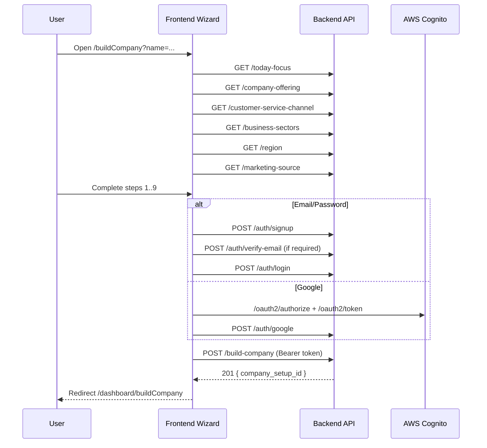

# API Sequence for `/buildCompany` Flow

## Sequence A - Email/password path (most direct)
1. `GET /api/today-focus`
2. `GET /api/company-offering`
3. `GET /api/customer-service-channel`
4. `GET /api/business-sectors`
5. `GET /api/region`
6. `GET /api/marketing-source`
7. User completes 9-step wizard in frontend local state.
8. `POST /api/auth/signup` (if user is new)
9. `POST /api/auth/verify-email` (if Cognito confirmation required)
10. `POST /api/auth/login`
11. `POST /api/build-company` (with Bearer token)
12. Redirect to `/dashboard/buildCompany`

## Sequence B - Existing user login path
1. Catalog GET calls as above.
2. Wizard completion.
3. `POST /api/auth/login`
4. `POST /api/build-company`

## Sequence C - Google OAuth path
1. Catalog GET calls as above.
2. Wizard completion.
3. Browser redirects to Cognito hosted UI + Google.
4. Frontend exchanges `code` at Cognito `/oauth2/token` (external to backend).
5. `POST /api/auth/google` (idToken + countryCode)
6. `POST /api/build-company` with access token obtained from Cognito.

## Sequence Diagram

## Data Dependencies Across Steps
- `company_name`: query param from route, stored in step0.
- Step outputs used in final payload:
  - step2 -> `today_focus`
  - step3 -> `company_offering`, `customer_service_channel`
  - step4 -> `business_sector_id` or `business_sector_other`, `about`
  - step5 -> `region_id`, `street`, `zip_code`, `phone_number`
  - step6 -> `has_employees`
  - step7 -> `is_registered_company`
  - step8 -> `hasStartedActivities`
  - step9 -> `marketing_source`

All these are required for `POST /api/build-company` and are assembled only after auth is successful.